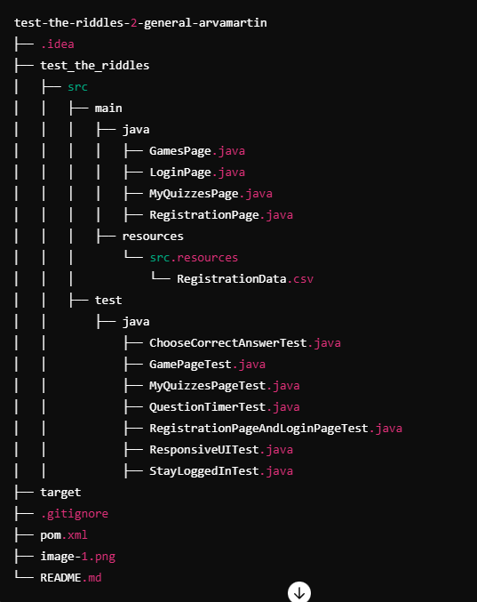
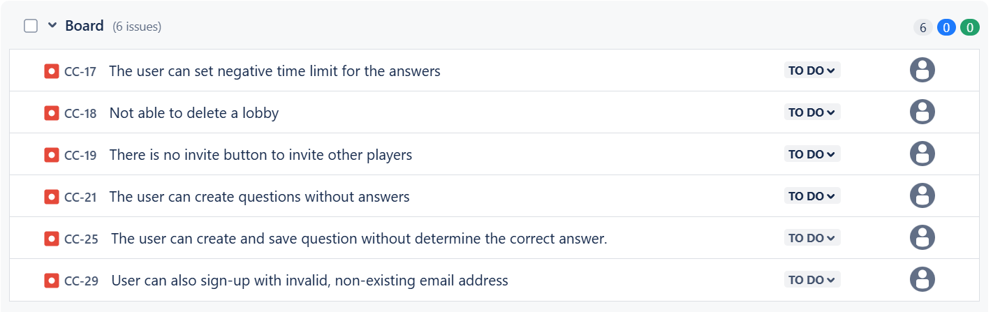

# Test the riddles

# Overview
This project contains automated tests for the Reptile Riddles 1.5.1 quizz game application using Selenium. The tests cover various functionalities of the application, such as user registration, login, quizz management, and responsiveness of the user interface.

## Table of Contents
- [Team Members](#team-members)
- [Technologies](#technologies)
- [Project Structure](#project-structure)
- [Prerequisites](#prerequisites)
- [User stories](#user-stories)
- [Bug report](#bug-report)
- [Test Details](#test-details)

## Team Members

- [Mészáros Ádám](https://github.com/adesz0112)
- [Árva Martin](https://github.com/arvamartin)

## Technologies
The following technologies and tools are used in this project:

* Java: The programming language used for writing test scripts.
* Selenium: A web testing framework used to automate browser interactions.
* JUnit: A testing framework for Java used to write and run tests.
* Apache Maven: A build automation tool used for project management and dependency management.
* WebDriver: A tool for controlling web browsers (in this case, Microsoft Edge(126.0.2592.113)).

## Project Structure
The project is organized into the following directories and files:

## Prerequisites
Before running the tests, ensure you have the following installed:

* Java Development Kit (JDK) 8 or higher
* Apache Maven
* WebDriver for the browsers you wish to test (Edge in this case (Version: 126.0.2592.113))
* Environment variables set for usernames and passwords: **You must register your own credentials first**

## User stories
1. As a new user, I want to choose my own username and password during registration, so that I can personalize 
my login credentials.
2. As a user, I want an option to stay logged in, so that I don’t have to enter my credentials every time.
3. As a quiz master, I want to create quizzes so that I can invite others to play.
4. As a quiz master, I want to select one correct answer for each question so that it is clear if a player got  
it right or not.
5. As a quiz master, I want to add more answer options to each question so that I can create a versatile quiz.
6. As a quiz master, I want to set the time players have to answer each question so that I can configure the    
difficulty of the questions.
7. As a quiz master, I want to make modifications to quizzes I had created so that I can make my quizzes better.
8. As a quiz master, I want to delete a quiz so that I can keep my dashboard clean.
9. As a quiz master, I want to use my fellow quiz masters' quizzes so that I have more options to organize 
games.
10. As a quiz master, I want to open a lobby for a quiz so that players can see what is about to be played and 
they can join in.
11. As a quiz master, I want to see the results when the game ends so that I can reward the winner.
12. As a player, I want to play quizzes so that I can compete against others.
13. As a player, I want to see what games accept players so that I can choose which one to join.

## Bug report

## Test Details